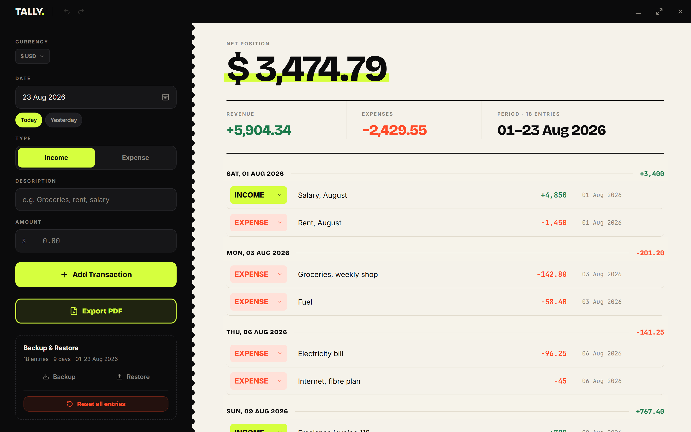
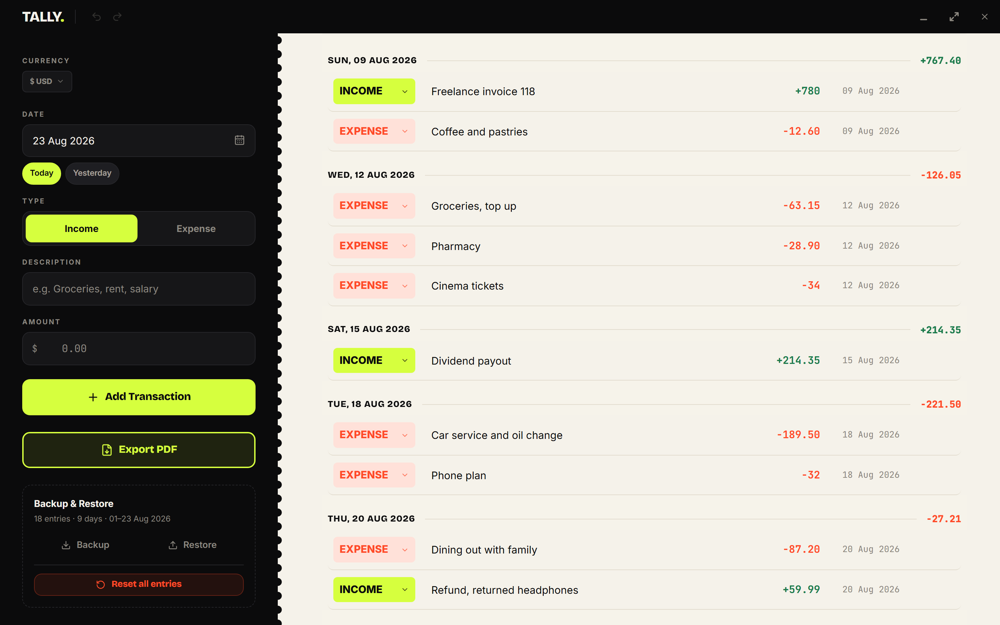
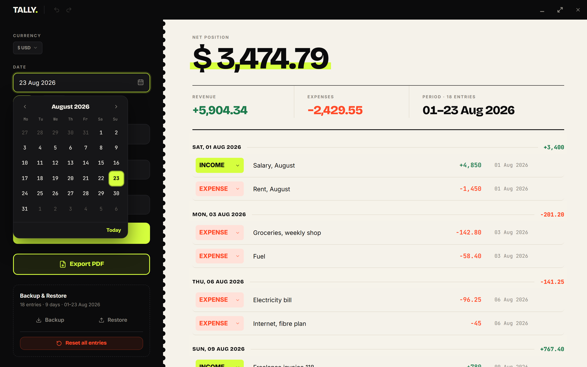
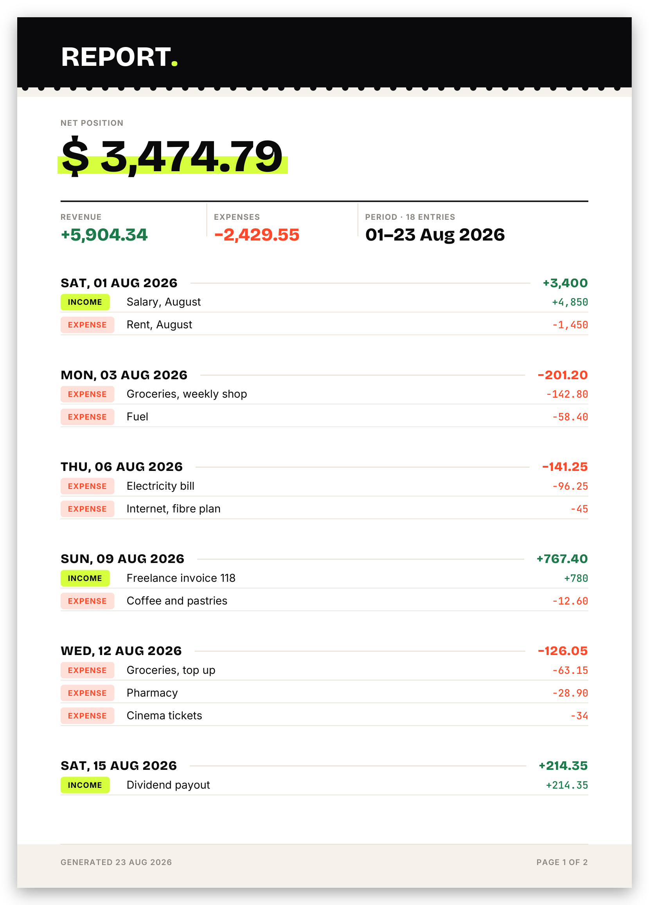

<div align="center">
  
</div>

# &nbsp;

A simple, private way to track household income and expenses. Tally runs entirely offline, as a
native desktop app or a browser tab, and keeps every entry local to your device.

[](#-leave-a-tip)

**[Try it in your browser →](https://tally-budget.vercel.app/)**

Runs entirely client side, so the hosted version behaves exactly like the desktop build: nothing
you type is sent anywhere, it just lives in that browser's local storage. Prefer a real desktop
window with its own icon and title bar? See [Getting started](#getting-started) below.



## What it does

- Add income and expense entries with a description, amount, type, and date.
- See totals update live: net position, revenue, and expenses for the current period.
- Entries are grouped by day and sorted chronologically into one running statement.
- Undo and redo for every change, including deletes, with a toast that lets you reverse a delete
  right away.
- Pick from 47 currencies. Amounts render with the correct symbol and formatting for each one.
- Export the full statement to a real vector PDF, drawn directly rather than captured as an image,
  so the text stays sharp and selectable.
- Back up the ledger to a JSON file and restore it later, on this machine or another one.
- Runs as a native Windows desktop app, built with Tauri, or in any modern browser.

### One running statement, grouped by day

Entries are never buried in a table you have to filter. They run in date order, grouped under the day
they happened on, with that day's net shown on the right of every divider.



### Edit in place, with a real date picker

Every row is the editor. Type, description, amount, and date all commit as you change them, and there
is no save button to hunt for. The date field opens a calendar built to match the rest of the app
rather than the browser default.



### Export a real PDF, not a screenshot

The statement is drawn into the PDF with vector text and shapes, so it stays sharp at any zoom and
the text can be selected and searched. Long descriptions wrap instead of being cut off, and no entry
is ever split across a page break.

<p align="center">
  
</p>

## Tech stack

- [React 19](https://react.dev) and [TypeScript](https://www.typescriptlang.org)
- [Vite 8](https://vite.dev) for the dev server and bundling
- [Tailwind CSS v4](https://tailwindcss.com), configured CSS first, with no `tailwind.config.js`
- [shadcn/ui](https://ui.shadcn.com) components on [Radix UI](https://www.radix-ui.com) primitives
- [lucide-react](https://lucide.dev) for icons
- [jsPDF](https://github.com/parallax/jsPDF) for the PDF export
- [Tauri v2](https://tauri.app) (Rust) for the desktop shell
- [sonner](https://sonner.emilkowal.ski) for toast notifications

## Getting started

### Prerequisites

For the web build you only need [Node.js](https://nodejs.org) 20 or newer.

For the desktop build you also need the [Tauri v2 prerequisites](https://tauri.app/start/prerequisites/)
for your platform. On Windows that means:

- [Rust](https://rustup.rs), stable channel, MSVC toolchain
- Microsoft C++ Build Tools, including the Windows SDK
- The WebView2 runtime, which already ships with Windows 10 and 11

### Install

```bash
git clone https://github.com/UMA1R-01/Tally-Budget.git
cd Tally-Budget
npm install
```

### Run

```bash
npm run dev
```

```bash
npm run tauri dev
```

`npm run dev` serves the web app at `http://localhost:5173`. `npm run tauri dev` launches the
desktop window and starts Vite for you. The first desktop run compiles the full Rust dependency
tree and can take several minutes; later runs are much faster.

### Build

```bash
npm run build
```

```bash
npm run tauri build
```

`npm run build` type-checks the project with `tsc` and bundles it to `dist/`. `npm run tauri build`
produces a Windows installer under `src-tauri/target/release/bundle/`. `npm run typecheck` runs the
type checker on its own, with no bundling, and `npm run preview` serves the production build
locally.

## Data and storage

The ledger lives in the browser's `localStorage`, under the key `tally_transactions`, and is saved
automatically on every change: adding, editing, and deleting are all durable the instant they
happen.

That storage belongs to one browser, on one device. Clearing site data, opening a private window,
or moving to a different machine loses it, which is exactly what Backup and Restore are for.

**Export PDF** produces a snapshot for reading, printing, or sharing. It cannot be read back into
the app. **Backup** writes a JSON file that can be restored later and is the only way to move a
ledger between devices or recover it after clearing storage.

## Project structure

```
src/
  components/       Rail, EntryForm, StatementHero, LedgerTable, TitleBar, ui primitives
  hooks/            useTransactions (state, undo/redo history), useCurrency
  services/         PDF export, JSON backup and restore
  lib/              date, money, currency, storage, and other pure helpers
src-tauri/
  src/              Tauri app entry point and window setup
  capabilities/     permission grants for the desktop shell
  icons/            app icon, generated for every platform size
```

## ☕ Leave a tip

💛 If you like this app, a tip is always welcome!

<div>


```
bc1qs25pegh3232q9j58kt5dgczymcj4pg8a5un2zp
```

</div>

<div>


```
0x81F29C9Dca41cb57395BE5b56c7606653A8c2E34
```

</div>

<div>


```
G57VrGCbAFWSe2vPfx2ZrUUxzJeiARncKUkYMxw3wKVa
```

</div>

## License

[MIT](LICENSE) © Umair Aamir
